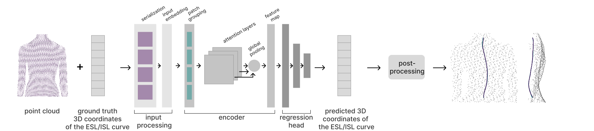

# Radiation-Free Scoliosis Monitoring

Adolescent idiopathic scoliosis (AIS) affects 1-3% of adolescents and requires regular monitoring during growth periods. This study investigates **deep learning methods combined with surface topography** to develop a non-invasive monitoring approach for AIS.

## Current challenges in scoliosis monitoring
- Repeated X-ray imaging exposes patients to harmful radiation
- Radiation exposure may increase cancer risk
- Need for safe, radiation-free monitoring methods during adolescent growth


## Methodology

### Approach
The primary objective is to **predict 3D spinal shape from back surface topography** using deep learning methods.\
The task is two-fold: reconstructing both the ESL (external spinal line) and ISL (internal spinal line) in 3D. Since surface appearance doesn't always match internal reality, a person might have surface asymmetry without significant internal spinal curvature, or vice versa.

The study compares two deep learning architectures:
- **UNet architecture** applied to 2D depth maps
- **Point Transformer model** applied to 3D point clouds

### Pipeline overview

#### 2D image-based approach


#### 3D backscan-based approach



### Two-stage training strategy
1. **Pre-training**: On estimated spinal curves
2. **Fine-tuning**: On radiography-derived spinal curves to overcome the challenge of limited reliable medical data

## Key Findings
- **ML-based spinal shape prediction from back scans is feasible**
- **2D depth map-based models outperformed 3D point cloud-based models**
- **Lower computational requirements for 2D approach**


## Installation & Usage
Tests were run on **Python 3.10.18**. PyTorch was installed with CUDA support: **2.5.1+cu121**.

### **Setup**

Create a python virtual environment and activate it:
```bash
python -m venv venv
source venv/bin/activate  # On Windows: venv\Scripts\activate
```

Install dependencies:
```bash
pip install -r requirements.txt
```

### **Configuration**

Each approach and task has separate configuration files. Navigate to the desired approach/task folder and modify the config files in the **config folder**.

### **Model training**


#### For 2D UNet approach
```bash
# ESL segmentation pre-training
python -m convolutional_neural_network.esl.silver_training

# ESL segmentation fine-tuning  
python -m convolutional_neural_network.esl.fine_tuning

# ISL segmentation pre-training
python -m convolutional_neural_network.isl.silver_training

# ISL segmentation fine-tuning
python -m convolutional_neural_network.isl.fine_tuning
```

#### For 3D Point Transformer approach
```bash
python -m point_transformer.silver_training # the task (ESL/ISL prediction) is set in the config file
```

### **Post-processing: reconstructing the 3D spinal shape**


#### For 2D UNet approach
```bash
# obtaining a single line, extracting predicted x,y,z coordinates, saving JSON files with ground truth coordinates, predicted coordinates, and metadata for every sample
# ESL prediction
python -m convolutional_neural_network.esl.evaluation.predicted_line_and_3d_coordinates

# ISL prediction
python -m convolutional_neural_network.isl.evaluation.predicted_line_and_3d_coordinates


# creating and saving ply files containing coordinates of the original 3d back scan, along with predicted and ground truth 3d spinal lines displayed in different colors
# ESL prediction
python -m convolutional_neural_network.esl.evaluation.combined_ply_generation_from_json

# ISL prediction
python -m convolutional_neural_network.isl.evaluation.combined_ply_generation_from_json
```

#### For 3D Point Transformer approach
```bash
# extracting predicted x,y,z coordinates, saving JSON files with ground truth coordinates, predicted coordinates, and metadata for every sample
python -m point_transformer.evaluation.3d_coordinates

# creating and saving ply files containing coordinates of the original 3d back scan, along with predicted and ground truth 3d spinal lines displayed in different colors
python -m point_transformer.evaluation.combined_ply_generation_from_json
```

## Data

### Data collection

3D backscan data were collected from Balgrist University Hospital (Zurich) and University Children Hospital (Basel), with additional datasets from Geneva University Hospital, IRCCS Istituto Ortopedico Galeazzi (Milan), and Poliklinika NADO Fizio Medico Centar (Zagreb). All data collection received appropriate ethical approvals and complied with institutional guidelines. Partner-contributed data were fully anonymized. 

3D back surface reconstructions captured the unclothed posterior torso in upright posture with arms relaxed or flexed (hands on clavicles/temples). Scanning was performed by medical personnel using Photoneo MotionCam-3D M, Artec Eva, or DIERS formetric 4D systems.

### Data storage and management

The custom dataset class is built around the specific file structure and naming convention.

#### **2D approach**

File paths for depthmaps, ISL masks, and ESL masks are configured in the config files. All files follow the naming pattern: **hospital_patientId_...png**
 - Geneva and Balgrist: Patients may have multiple samples (handled in dataset splitting)
 - Geneva: Patient IDs may include suffixes (e.g., patientId-01)

 #### **3D approach**

 The base path in the config file points to a directory containing patient folders with these naming rules:
  - Standard format: hospital_patientID
  - Balgrist: hospital_patientID_{flex/relax} (two folders per patient)
  - Geneva: Patient IDs may include suffixes (e.g., patientId-01)

Each patient folder contains preprocessed files named using **the specific patient folder name**:

 - {patient_folder_name}_processed.ply - 3D point cloud of the back surface
 - {patient_folder_name}_metadata_processed.json - JSON file containing 3D points of the ground truth ESL and ISL curves